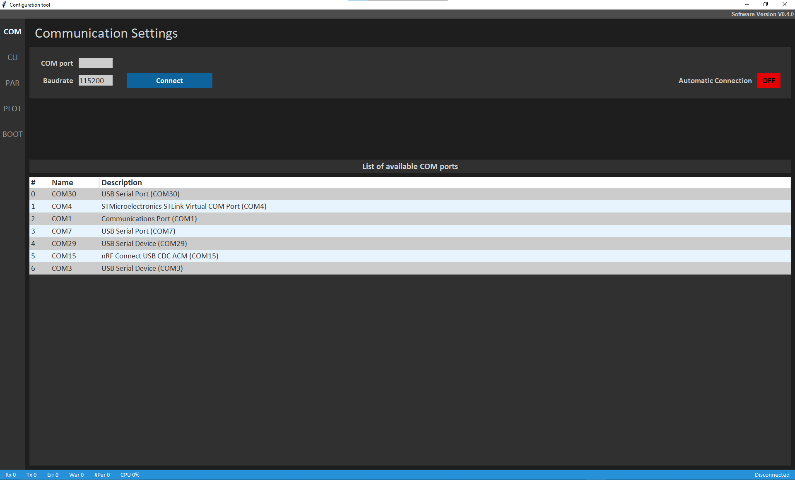
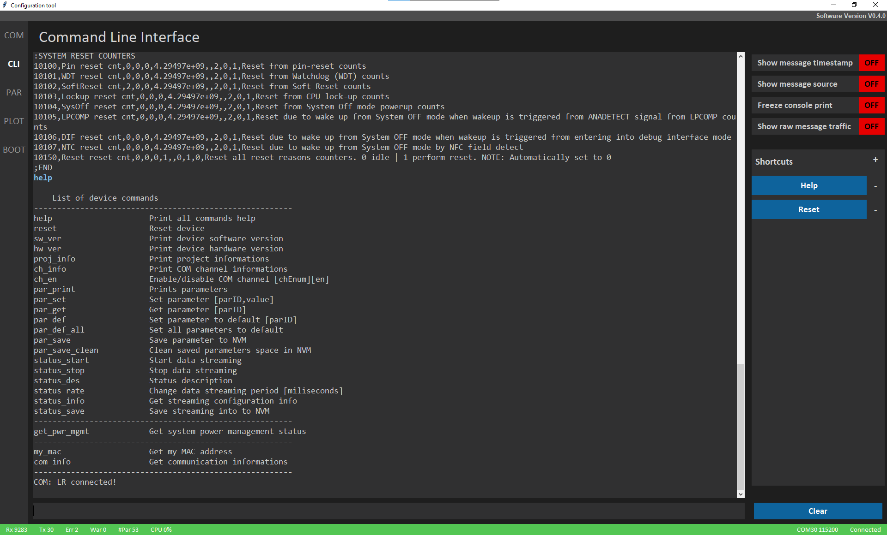
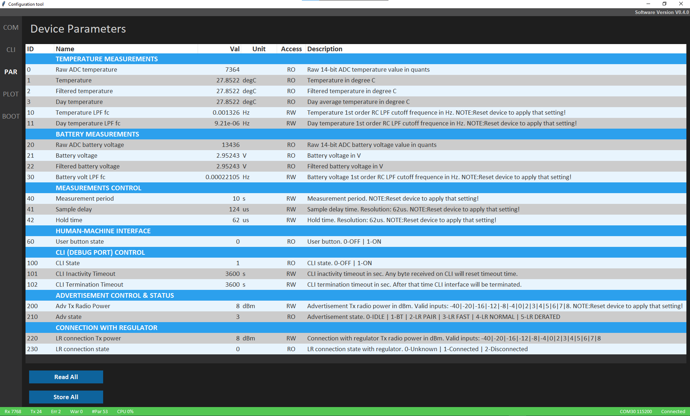
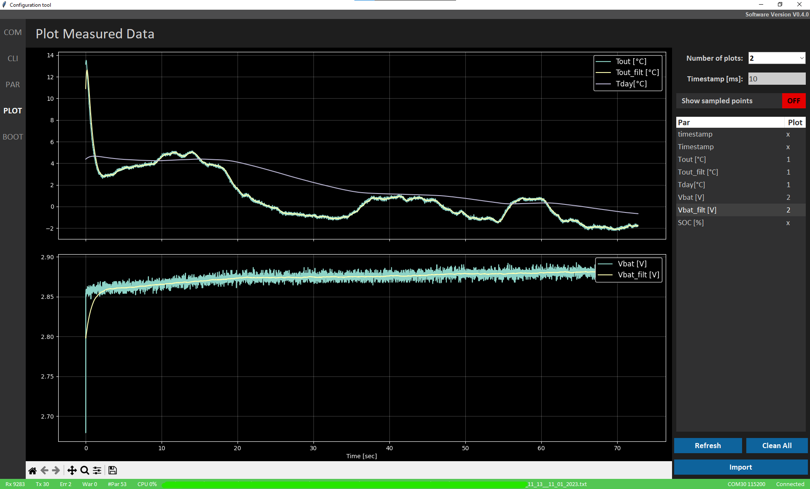

# PC Application for embedded device configuration
PC application for embedded device configuration and diagnostics in real-time.

## Communication setup menu

## Command line interface (CLI) menu

## Device parameters menu

## Offline plot viewer menu

